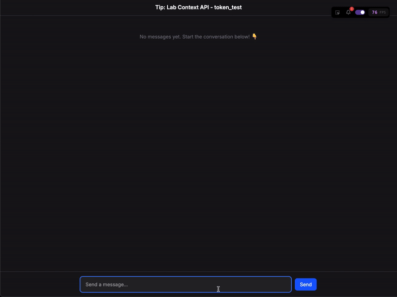
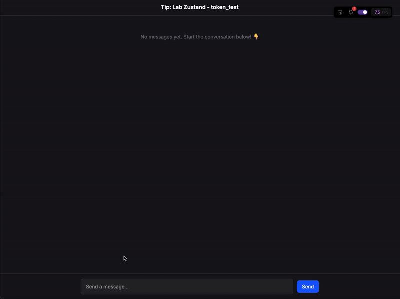

# Relatório de Aprendizados: Otimização e Gerenciamento de Estado em React

Este relatório detalha os aprendizados obtidos durante o desenvolvimento do projeto [state-management-battle](https://github.com/wevertoum/state-management-battle), com foco na comparação entre Zustand e Context API para gerenciamento de estado, e na implementação de técnicas de otimização de performance como Lazy Loading, Code-Splitting, Suspense e Error Boundaries.

## Parte 1: Comparativo de Gerenciamento de Estado: Zustand vs. Context API

Nesta seção, analisamos duas abordagens para gerenciamento de estado em uma aplicação de chat: a Context API nativa do React e a biblioteca Zustand. O objetivo foi comparar a performance, a complexidade da implementação e a experiência de desenvolvimento.

### Implementação com Context API

A Context API permite o compartilhamento de estado entre componentes sem a necessidade de passar props manualmente em cada nível da árvore de componentes. No projeto, foi criado um `ChatProvider` para gerenciar o estado do chat, incluindo mensagens, status de digitação, e o título da página.

**Estrutura do Contexto (`context/ChatContext.tsx`):**

```typescript
import {
  createContext,
  useContext,
  useState,
  useEffect,
  type ReactNode,
} from 'react';
import type { ChatMessage } from '../types/chat';
import { faker } from '@faker-js/faker';

// ... (definição da interface ChatContextType) ...

const ChatContext = createContext<ChatContextType | undefined>(undefined);

export function ChatProvider({
  children,
  token = 'Tip: Lab Context API',
}: ChatProviderProps) {
  const [messages, setMessages] = useState<ChatMessage[]>([]);
  const [isTyping, setIsTyping] = useState(false);
  const [titlePage, setTitlePage] = useState('Tip: Lab Context API');

  // ... (useEffect para carregar/salvar no localStorage) ...

  const sendMessage = (content: string) => {
    setTitlePage('Novo title após enviar mensagem - ctx'); // Atualiza o estado
    const humanMessage: ChatMessage = {
      // ...
      content: content + ` - TOKEN: ${token}`,
      // ...
    };
    setMessages((prev) => [...prev, humanMessage]);
    setIsTyping(true);
    // ... (simulação de resposta do bot) ...
  };

  const deleteMessage = (id: string) => {
    setMessages((prev) => prev.filter((message) => message.id !== id));
  };

  return (
    <ChatContext.Provider
      value={{
        messages,
        sendMessage,
        deleteMessage,
        isTyping,
        titlePage,
        setTitlePage,
        token,
      }}
    >
      {children}
    </ChatContext.Provider>
  );
}

export function useChat() {
  const ctx = useContext(ChatContext);
  if (!ctx) throw new Error('useChat must be used within a ChatProvider');
  return ctx;
}
```

Os componentes `TitlePageCtx`, `MessageListCtx` e `PromptCtx` consomem este contexto utilizando o hook `useChat`.

### Implementação com Zustand

Zustand é uma solução de gerenciamento de estado pequena, rápida e escalável, baseada em hooks. Ela se destaca pela simplicidade e pela forma como lida com re-renders, atualizando apenas os componentes que consomem a parte específica do estado que mudou.

**Criação do Store (`stores/useChatStore.ts`):**

```typescript
import { create } from 'zustand';
import { persist, createJSONStorage } from 'zustand/middleware';
import type { ChatMessage } from '../types/chat';
import { useAuthStore } from './useAuthStore'; // Store de autenticação separado

// ... (definições de interface ChatActions e ChatStore) ...

export const useChatStore = create<ChatStore>()(
  persist(
    (set, get) => ({
      messages: [],
      titlePage: 'Tip: Lab Zustand',
      isTyping: false,
      actions: {
        sendMessage: async (content: string) => {
          const currentToken = useAuthStore.getState().token; // Acessando outro store
          const messageContentWithToken = currentToken
            ? `${content} - TOKEN: ${currentToken}`
            : content;

          set({ titlePage: 'Novo title após enviar mensagem - ztd' }); // Atualização seletiva

          const humanMessage: ChatMessage = {
            // ...
            content: messageContentWithToken,
            // ...
          };

          set((state) => ({ messages: [...state.messages, humanMessage] }));
          set({ isTyping: true });

          // ... (lógica de chamada de API e resposta do bot) ...
        },
        deleteMessage: (id: string) => {
          set((state) => ({
            messages: state.messages.filter((message) => message.id !== id),
          }));
        },
      },
    }),
    {
      name: 'chat_messages', // Chave para persistência no localStorage
      storage: createJSONStorage(() => localStorage), // Define o storage
      partialize: (state) => ({ messages: state.messages }), // Persiste apenas as mensagens
      // ... (lógica de reidratação) ...
    }
  )
);

// Hooks personalizados para acesso seletivo ao estado
export const useChatTitlePage = () => useChatStore((state) => state.titlePage);
export const useChatMessages = () => useChatStore((state) => state.messages);
export const useChatIsTyping = () => useChatStore((state) => state.isTyping);
export const useChatActions = () => useChatStore((state) => state.actions);
```

**Funcionalidades do Zustand Utilizadas:**

  * **Persistência de Estado:** O middleware `persist` foi usado para salvar e reidratar automaticamente as mensagens do chat no `localStorage`, garantindo que o histórico da conversa não seja perdido ao recarregar a página.
    ```typescript
    persist(
      (set, get) => ({ /* ... store definition ... */ }),
      {
        name: 'chat_messages', // Chave no localStorage
        storage: createJSONStorage(() => localStorage),
        partialize: (state) => ({ messages: state.messages }), // Apenas 'messages' será persistido
      }
    )
    ```
  * **Memoização de Componentes:** Embora o `React.memo` seja uma API do React, sua eficácia é amplificada com Zustand. Como Zustand permite subscrições granulares ao estado, os componentes só re-renderizam quando a fatia específica do estado que eles consomem é alterada. Isso, combinado com `memo`, minimiza re-renders desnecessários.
    ```typescript
    // Exemplo em components/zustand/TitlePageZtd.tsx
    const TitlePageZtd = memo(function TitlePageZtd() {
      const titlePage = useChatTitlePage(); // Hook seletivo
      // ...
    });
    ```
  * **Ações Centralizadas:** As funções para modificar o estado (`sendMessage`, `deleteMessage`) são definidas diretamente dentro do store (`actions`), tornando a lógica de negócios centralizada e fácil de gerenciar.
    ```typescript
    // Dentro de useChatStore
    actions: {
      sendMessage: async (content: string) => { /* ... */ },
      deleteMessage: (id: string) => { /* ... */ },
    }
    ```
  * **Separação de Lógica de Estado com Hooks Personalizados:** Foram criados hooks específicos (`useChatMessages`, `useChatIsTyping`, `useChatActions`, `useChatTitlePage`) que selecionam apenas as partes necessárias do estado (granularidade). Isso otimiza a performance e deixa o código mais limpo e fácil de entender.

    ```typescript
    // Exemplo de hook seletivo
    export const useChatMessages = () => useChatStore((state) => state.messages);

    // Uso no componente MessageListZtd.tsx
    const messages = useChatMessages(); // Componente só re-renderiza se 'messages' mudar
    ```
  * **Integração com Autenticação:** Um store separado (`useAuthStore`) foi criado para gerenciar o token de autenticação. O `useChatStore` acessa o token diretamente de `useAuthStore` usando `useAuthStore.getState().token` dentro da ação `sendMessage`, demonstrando a facilidade de composição e acesso a múltiplos stores.
    ```typescript
    // stores/useAuthStore.ts
    export const useAuthStore = create<TokenStore>((set) => ({
      token: null,
      initializeToken: (token: string) => set({ token }),
    }));

    // Acesso em useChatStore.ts
    const currentToken = useAuthStore.getState().token;
    ```

### Análise de Performance dos Casos de Gerenciamento de Estado

A análise de performance foi realizada enviando a mensagem "oi" 4 vezes em cada uma das implementações. Os resultados de renderização dos componentes foram monitorados utilizando as ferramentas de desenvolvedor do React.

-----

#### 1\. Caso 1: `useContext` com re-render em todos os componentes filhos

**Cenário:**
Após enviar a mensagem "oi" 4 vezes na página que utiliza Context API (`ChatProvider`), temos o seguinte resultado de renders:

  * **TitlePageCtx**: 9 renders (memoizados)
  * **MessageListCtx**: 9 renders (memoizados)
  * **PromptCtx**: 17 renders (memoizados)
  * **ChatProvider**: 9 renders

-----

  * **Total de renders:** 75
  * **FPS registrado:**


-----

#### 2\. Caso 2: Zustand com re-render apenas nos componentes necessários

**Cenário:**
Após enviar a mensagem "oi" 4 vezes na página que utiliza Zustand (`LabZustand`), temos o seguinte resultado de renders:

  * **TitlePageZtd**: 1 render (memoizado)
  * **MessageListZtd**: 8 renders (memoizados)
  * **PromptZtd**: 12 renders (memoizados)

-----

  * **Total de renders:** 39
  * **FPS registrado:** 


-----

#### 3\. Caso 3: Feedback Visual de Performance registrado com [React Scan](https://react-scan.com/)

**Cenário:**
É possívele observar visualmente todos os componentes que foram renderizados quando uma mensagem é enviada através de um destaque ao redor de cada componente.

1 . **Context API:**
É possível observar que todos os componentes que consomem o contexto são re-renderizados, mesmo que não tenham mudado o estado que consomem.



2 . **Zustand:**
Observe que apenas os componentes que consomem a parte específica do estado que foi alterada são re-renderizados.



-----

### Conclusão da Comparação (Zustand vs. Context API)

A análise de performance demonstra uma vantagem significativa para o Zustand em termos de número de re-renders. Com a Context API, mesmo com `React.memo`, qualquer alteração no valor do contexto (`value` no `ChatContext.Provider`) tende a causar re-renderizações nos componentes consumidores, pois o objeto de contexto em si é alterado. Atualizar o `titlePage` no `ChatProvider`, por exemplo, recria o objeto `value`, fazendo com que `TitlePageCtx`, `MessageListCtx` e `PromptCtx` recebam novas props (o objeto `value` em si) e potencialmente re-renderizem, mesmo que a parte específica do estado que eles usam não tenha mudado.

Zustand, por outro lado, permite que os componentes se inscrevam seletivamente a fatias do estado. O `TitlePageZtd`, por exemplo, que consome `useChatTitlePage`, só renderizou uma vez inicialmente, pois o título da página só foi alterado uma vez na ação `sendMessage` e depois não mudou nas mensagens subsequentes. Os demais componentes (`MessageListZtd`, `PromptZtd`) também apresentaram um número menor de renders.

**Link para acessar o projeto rodando:** [state-management-battle.vercel.app](https://state-management-battle.vercel.app/)


-----

## Parte 2: Aprendizados sobre Lazy Loading, Code-Splitting, Suspense e ErrorBoundary

Nesta seção, exploramos técnicas para otimizar o carregamento inicial da aplicação e melhorar a experiência do usuário através do carregamento sob demanda de componentes e tratamento de erros.

### Principais Conceitos e Funcionalidades Aprendidas

  * **Lazy Loading com `React.lazy`:**
    Permite que componentes sejam carregados apenas quando são efetivamente necessários para a renderização, em vez de serem incluídos no bundle principal da aplicação. Isso é feito dinamicamente usando a função `import()`.
    No projeto, os componentes `SlowComponent` e `ErrorComponent` na `PageB` são carregados usando `React.lazy`.

    **Exemplo (`routes/code-splitting-lab/page-b/page.tsx`):**

    ```typescript
    import { useState, Suspense, lazy } from 'react';
    // ...

    async function delayForDemo(promise: any) {
      await new Promise((resolve) => {
        setTimeout(resolve, 2000); // Simula um delay de 2 segundos no carregamento
      });
      return promise;
    }

    // Componentes carregados sob demanda
    const LazySlow = lazy(() =>
      delayForDemo(import('../../../components/lazy/SlowComponent'))
    );
    const LazyError = lazy(() =>
      delayForDemo(import('../../../components/lazy/ErrorComponent'))
    );
    ```

    O `delayForDemo` é uma função utilitária para simular um carregamento mais lento e visualizar o estado de `Suspense` de forma mais clara.

  * **Code-Splitting:**
    É a prática de dividir o código da aplicação em "pedaços" (chunks) menores que podem ser carregados sob demanda. `React.lazy` é uma forma de implementar code-splitting no nível do componente. Frameworks de roteamento modernos, como o Remix (utilizado neste projeto), frequentemente oferecem code-splitting no nível da rota por padrão (Route Modules), onde o código para uma rota específica só é baixado quando o usuário navega para ela.

  * **Suspense:**
    O componente `Suspense` permite que você exiba um conteúdo de fallback (como um indicador de carregamento) enquanto os componentes carregados com `React.lazy` ainda estão sendo baixados e processados.
    No `CodeSplittingLabLayout.tsx`, `Suspense` é usado para envolver o `<Outlet />`, mostrando uma mensagem de carregamento enquanto as páginas A, B ou C são carregadas. Na `PageB`, `Suspense` é usado individualmente para `LazySlow` e `LazyError`.

    **Exemplo de `Suspense` no layout (`routes/code-splitting-lab/layout.tsx`):**

    ```typescript
    // ...
    return (
      <main /* ... */>
        {/* ... (header com navegação) ... */}
        <section className='flex-1 overflow-y-auto px-6 py-8'>
          <Suspense
            fallback={<p className='text-zinc-400'>Carregando página...</p>}
          >
            <Outlet /> {/* Conteúdo da rota será renderizado aqui */}
          </Suspense>
        </section>
        {/* ... (footer) ... */}
      </main>
    );
    ```

    **Exemplo de `Suspense` na página (`routes/code-splitting-lab/page-b/page.tsx`):**

    ```typescript
    // ...
    {showComponents && (
      <>
        <Suspense
          fallback={
            <p className='text-yellow-400'>
              ⏳ Carregando componente lento...
            </p>
          }
        >
          <LazySlow label='Componente carregado com atraso!' />
        </Suspense>

        <ErrorBoundary /* ... */ >
          <Suspense
            fallback={
              <p className='text-yellow-400'>
                ⏳ Carregando componente com erro...
              </p>
            }
          >
            <LazyError />
          </Suspense>
        </ErrorBoundary>
      </>
    )}
    // ...
    ```

  * **ErrorBoundary:**
    São componentes React que capturam erros de JavaScript em qualquer lugar na sua árvore de componentes filhos, registram esses erros e exibem uma UI de fallback em vez da árvore de componentes que quebrou. Isso previne que a aplicação inteira pare de funcionar devido a um erro em uma parte isolada.
    No projeto, um `ErrorBoundary` genérico foi criado e utilizado para envolver o `LazyError` na `PageB`.

    **Implementação do `ErrorBoundary` (`components/ErrorBoundary.tsx`):**

    ```typescript
    import { Component, type ReactNode } from 'react';

    type Props = {
      children: ReactNode;
      fallback?: ReactNode; // UI de fallback customizável
    };
    type State = { hasError: boolean };

    export class ErrorBoundary extends Component<Props, State> {
      constructor(props: Props) {
        super(props);
        this.state = { hasError: false };
      }

      // Este método é chamado durante a fase de "render" se um erro for lançado
      static getDerivedStateFromError() {
        // Atualiza o estado para que o próximo render mostre a UI de fallback.
        return { hasError: true };
      }

      // Este método é chamado quando um erro é capturado
      componentDidCatch(error: Error, errorInfo: React.ErrorInfo) {
        console.log('Error caught in ErrorBoundary:', error, errorInfo);
      }

      override render() {
        if (this.state.hasError) {
          return (
            this.props.fallback || <p className='text-red-500'>Algo deu errado.</p>
          );
        }
        return this.props.children;
      }
    }
    ```

    **Uso do `ErrorBoundary` (`routes/code-splitting-lab/page-b/page.tsx`):**

    ```typescript
    <ErrorBoundary
      fallback={
        <p className='text-red-400'>🚨 Algo deu errado ao carregar!</p>
      }
    >
      <Suspense /* ... */ >
        <LazyError />
      </Suspense>
    </ErrorBoundary>
    ```

    O `ErrorComponent` (`components/lazy/ErrorComponent.tsx`) foi projetado para simular um erro quando um botão é clicado, permitindo testar o `ErrorBoundary`.

  * **Performance:**
    A combinação dessas técnicas resulta em uma melhoria significativa na performance percebida pelo usuário:

      * **Tempo de Carregamento Inicial (TPI) Reduzido:** Ao dividir o código e carregar componentes apenas quando necessário, o tamanho do bundle inicial diminui, levando a um carregamento mais rápido da página principal.
      * **Melhor Experiência do Usuário (UX):** `Suspense` fornece feedback visual durante o carregamento de partes da UI, e `ErrorBoundary` previne que a aplicação quebre totalmente, apresentando uma mensagem amigável ou uma UI alternativa.

### Conclusão sobre Otimizações de Carregamento

O uso de `React.lazy`, `Suspense` e `ErrorBoundary` são ferramentas poderosas para criar aplicações React mais performáticas e resilientes.
O **lazy loading** e o **code-splitting** são essenciais para reduzir o tempo de carregamento inicial, especialmente em aplicações grandes. O **Suspense** melhora a experiência do usuário ao fornecer feedback durante esses carregamentos assíncronos. Já o **ErrorBoundary** é crucial para a robustez da aplicação, garantindo que erros em partes isoladas da UI não comprometam a experiência do usuário como um todo.
A estrutura de rotas do projeto, utilizando o layout `CodeSplittingLabLayout.tsx` com `<Outlet />` e `Suspense`, demonstra uma aplicação prática e eficaz dessas técnicas para carregamento de páginas sob demanda.

-----

## Parte 3: Aprendizados sobre Ferramentas de debug em React