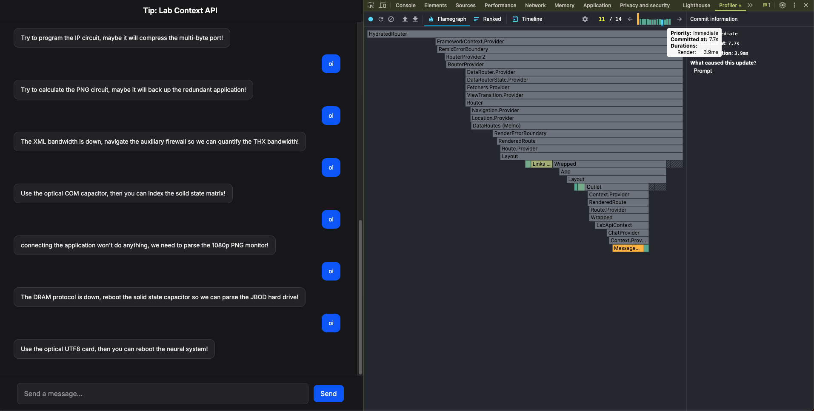
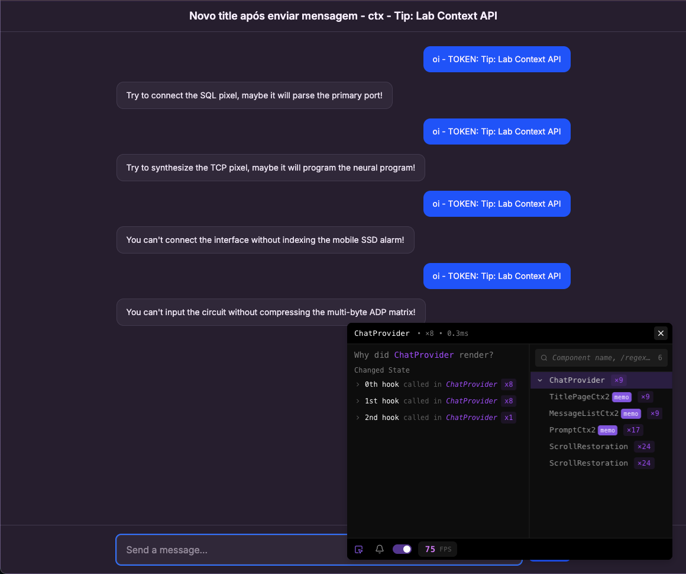
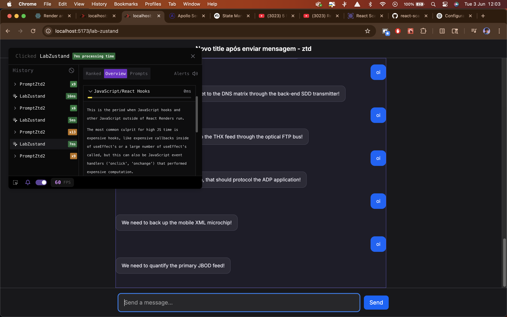
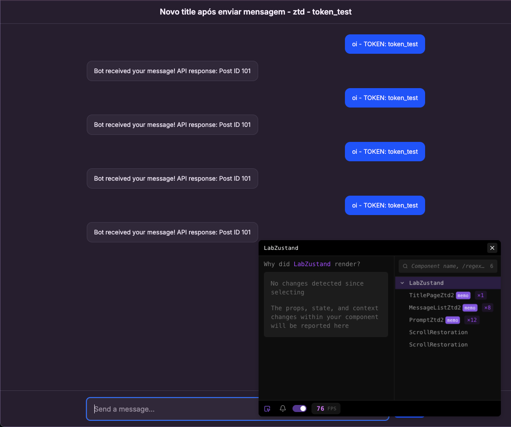

### 1 - Primeiro caso com useContext com re-render em todos os componentes filhos

Após mandar a mensagem "oi" 4 vezes na página que implementa Context API (ChatProvider), temos o seguinte resultado:

- **TitlePageCtx**: 9 memo
- **MessageListCtx**: 9 memo
- **PromptCtx**: 17 memo
- **ChatProvider**: 9 renders
__________
- **Total renders**: 75 FPS

### 2 - Segundo caso com Zustand com re-render apenas no componentes que realmente precisam

Após mandar a mensagem "oi" 4 vezes na página que implementa Zustand (LabZustand), temos o seguinte resultado:

- **TitlePageZtd**: 1 memo
- **MessageListZtd**: 8 memo
- **PromptZtd**: 12 memo
__________
- **Total renders**: 39 FPS

